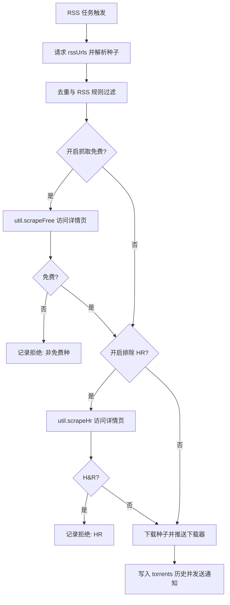
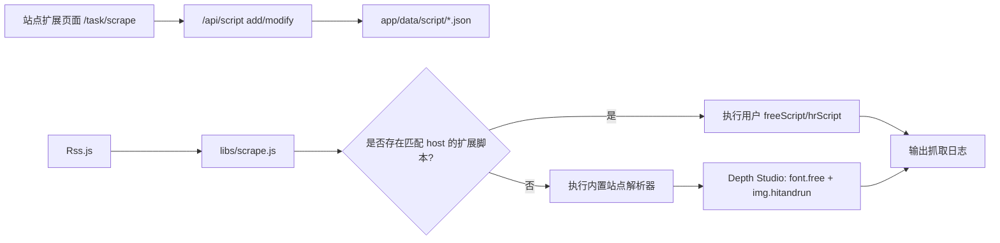

# Vertex 项目结构与架构

## 代码结构

```text
vertex/
├── app/                         # Node.js 后端
│   ├── app.js                   # 应用启动、全局运行实例初始化
│   ├── common/                  # 长生命周期任务对象
│   │   ├── Rss.js               # RSS 抓取、规则过滤、推送下载器
│   │   ├── Site.js              # 站点信息刷新、搜索、按 ID 推送
│   │   └── Script.js            # 定时脚本运行器
│   ├── controller/              # API 控制器
│   ├── model/                   # 配置增删改查与任务重载
│   ├── libs/
│   │   ├── scrape.js            # 免费/HR 详情页解析与扩展脚本入口
│   │   ├── rss.js               # RSS XML 解析
│   │   ├── site/                # 内置站点适配器
│   │   ├── util.js              # 请求、DB、文件列表等公共工具
│   │   └── logger.js            # log4js 日志
│   └── data/                    # JSON 配置与运行数据
├── webui/                       # Vue 3 + Ant Design Vue 前端
│   └── src/
│       ├── api/                 # API 封装
│       ├── pages/task/Rss.vue   # RSS 任务配置
│       ├── pages/task/Script.vue# 定时脚本配置
│       └── pages/task/Scrape.vue   # 站点抓取扩展配置
├── docker/                      # 容器启动文件
└── webhook/                     # 外部 Webhook 集成
```

## RSS 免费与 HR 过滤流程



## 抓取扩展架构



## 站点抓取扩展脚本约定

在“任务配置 → 站点扩展”页面填写 `站点 Host`，例如 `dstudio.me`。`免费判断` 和 `HR 判断` 都需要返回一个函数：

```js
async function ({ document, body, url, cookie, host, logger, util }) {
  return true
}
```

返回 `true` 表示命中对应状态。多个 host 可以使用英文逗号分隔。扩展脚本优先于内置解析器执行，适合在不修改源码的情况下快速支持新站点。
